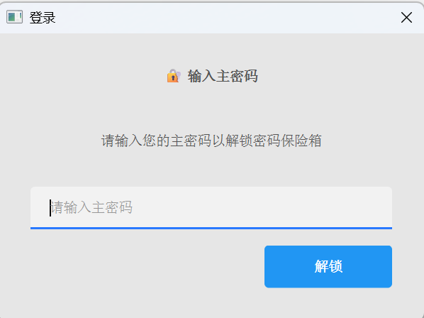
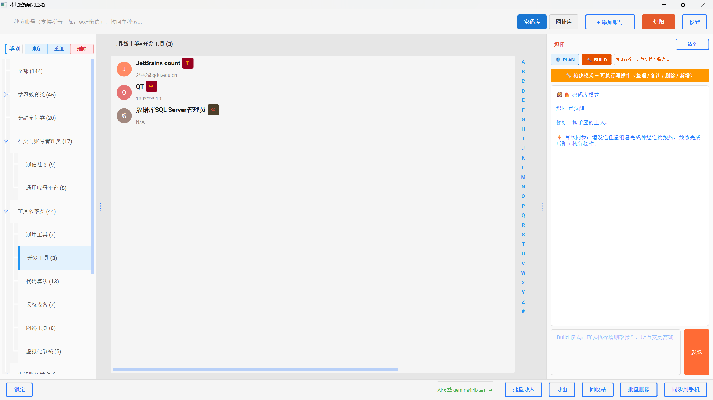
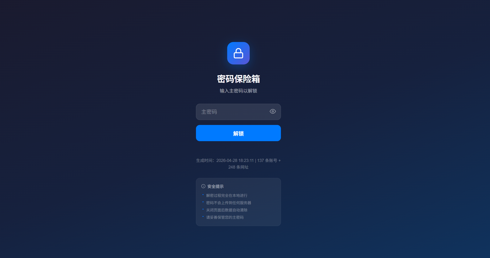
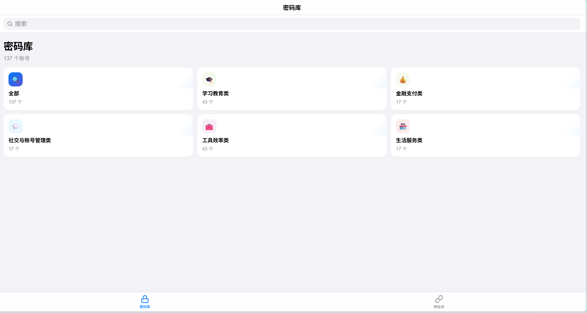
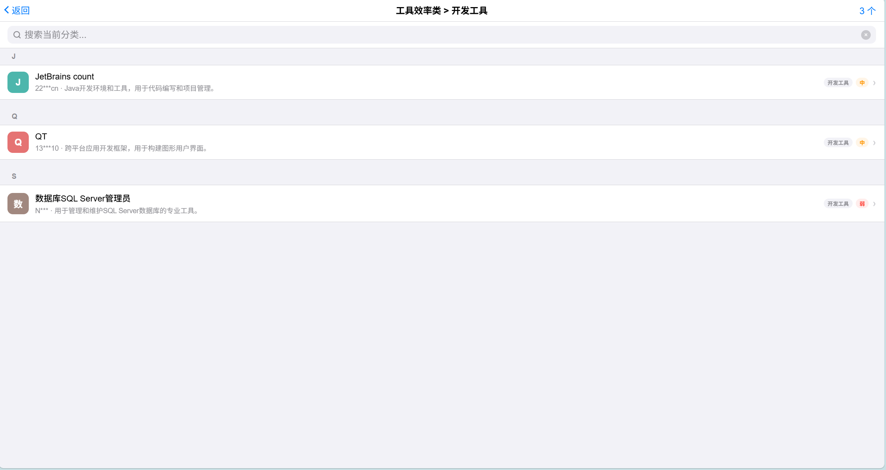
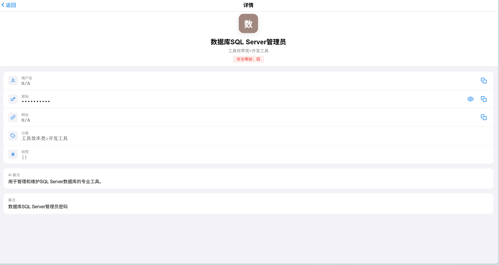

# 🔐 本地密码保险箱

> 你的密码，只属于你。一个基于 PyQt6 的桌面密码管理器，集成本地 AI 进行智能分类与语义搜索，所有数据本地加密存储，零云端依赖。

[](https://www.python.org/downloads/)
[](https://www.riverbankcomputing.com/software/pyqt/)
[](LICENSE)

---

## ✨ 功能特性

### 🔒 安全存储
- **AES-256-GCM 端到端加密**：所有敏感字段（应用名、账号、密码、备注等）均使用 AES-256-GCM 认证加密
- **PBKDF2 密钥派生**：主密码通过 10 万次迭代派生加密密钥，盐值随机生成
- **主密码遗忘 = 数据不可恢复**：没有后门，没有密码找回，你的数据只有你能打开
- **锁屏保护**：离开电脑时一键锁定，防止他人窥屏

### 🤖 本地 AI 助手（Ollama）
- **智能分类**：AI 自动分析应用名称，推荐合适的分类，支持批量智能分类
- **语义搜索**：自然语言描述即可搜索账号（如"我那个购物网站的账号"）
- **AI 备注生成**：根据应用名和网址自动生成用途说明
- **AI 对话助手**：通过自然语言管理密码（"帮我把所有教育类网站移到学习分类"）
- **完全离线**：基于本地 Ollama 部署，数据不上传云端

### 📁 双库管理
- **密码库**：管理账号、密码、网址、备注、标签、安全等级
- **网址库**：独立的常用网址收藏，支持访问次数统计
- **二级分类体系**：支持一级分类 + 子分类（如`工作 > 开发工具`）
- **拖拽排序**：分类栏支持自定义拖拽排序

### 🛡️ 数据保护
- **回收站**：软删除保留 30 天，支持一键恢复
- **操作快照**：AI 批量操作前自动创建快照，可随时回滚
- **审计日志**：记录 AI 助手的每次操作，可追溯可审查

### 📱 离线同步
- **PWA 密包导出**：生成单文件 HTML 加密包，手机浏览器打开即可离线查看
- **多格式导入/导出**：支持 Markdown、Excel、文本、浏览器书签导入导出

### 🔍 便捷操作
- **全局搜索**：支持拼音搜索、关键词高亮
- **剪贴板一键复制**：点击即可复制账号或密码
- **OCR 识别**：截图自动识别账号密码信息
- **密码强度检测**：实时评估密码安全性

---

## 🖥️ 界面预览


软件基本界面：


同步到手机界面：




---

## 📦 安装

### 环境要求

- Python 3.11+
- Windows 10/11（推荐）
- [Ollama](https://ollama.com)（用于 AI 功能，可选）

### 1. 克隆仓库

```bash
git clone https://github.com/leoyuan89/AIManage_for_everything.git
cd AIManage_for_everything
```

### 2. 创建虚拟环境

```bash
# 使用 conda（推荐）
conda create -n passwordmanage python=3.11
conda activate passwordmanage

# 或使用 venv
python -m venv venv
source venv/bin/activate  # Linux/Mac
venv\Scripts\activate     # Windows
```

### 3. 安装依赖

```bash
pip install -r requirements.txt
```

### 4. 安装 Ollama（可选，用于 AI 功能）

1. 访问 [ollama.com](https://ollama.com) 下载安装
2. 拉取模型：
   ```bash
   ollama pull gemma4:4b
   ```
3. 确保 Ollama 服务在后台运行

### 5. 运行

```bash
python main.py
```

---

## 🚀 首次使用

1. **设置主密码**：首次运行会弹出设置向导，设置一个强主密码（至少 6 位）
2. **添加账号**：点击"+"按钮添加你的第一个账号密码
3. **启用 AI**：在设置中配置 Ollama 地址（默认 `http://localhost:11434`）

> ⚠️ **重要**：请牢记主密码！遗忘后数据不可恢复，建议定期导出备份。

---

## 🏗️ 项目结构

```
AIManage_for_everything/
├── main.py                     # 程序入口
├── requirements.txt            # Python 依赖
│
├── core/                       # 核心模块
│   ├── crypto.py              # AES-256-GCM 加密引擎
│   ├── database.py            # SQLite 数据库管理（密码库）
│   ├── url_database.py        # 网址库数据库
│   ├── repositories.py        # 数据访问层
│   ├── clipboard.py           # 剪贴板操作
│   ├── theme_manager.py       # 主题管理
│   └── ...
│
├── ui/                         # 界面层（PyQt6）
│   ├── main_window.py         # 主窗口
│   ├── account_dialog.py      # 账号编辑对话框
│   ├── ai_classify_dialog.py  # AI 分类对话框
│   ├── lock_screen.py         # 锁屏界面
│   └── ...
│
├── services/                   # 业务逻辑层
│   ├── account_service.py     # 账号服务
│   ├── ai_assistant_service.py    # AI 助手服务
│   ├── ai_classification_service.py # AI 分类服务
│   ├── semantic_search_service.py   # 语义搜索
│   ├── sync_service.py        # 同步导出服务
│   └── ...
│
├── ai/                         # AI 客户端
│   └── ollama_client.py       # Ollama API 封装
│
├── models/                     # 数据模型
│   ├── account.py
│   └── url_item.py
│
├── templates/                  # 模板资源
│   └── pwa_template.html      # 移动端 PWA 模板
│
└── docs/                       # 开发文档
    ├── v1.0_implementation_guide.md  # 实现详解
    └── debug_journal.md       # 问题排查记录
```

---

## 🔐 安全架构

### 加密方案

```
明文数据
    ↓
PBKDF2-HMAC-SHA256 (100,000 次迭代)
    ↓
AES-256-GCM 认证加密
    ↓
Base64 编码存储到 SQLite
```

### 安全特性

- **零知识架构**：开发者无法访问你的主密码或数据
- **本地唯一**：数据库默认存储在用户目录 `~/.local_password_vault/`，不在项目目录内
- **无网络传输**：除调用本地 Ollama 外，不发起任何网络请求
- **内存安全**：密码字段使用 `Password` 回显模式，不直接显示在界面

---

## ⚙️ 配置说明

数据目录：`~/.local_password_vault/`

| 文件 | 说明 |
|------|------|
| `vault.db` | 密码库（SQLite，加密存储） |
| `vault_urls.db` | 网址库（SQLite） |
| `config.json` | 配置文件（含加密盐值、主题设置） |

---

## 🛠️ 开发

### 技术栈

| 层级 | 技术 |
|------|------|
| GUI | PyQt6 + qt-material |
| 数据库 | SQLite（标准库） |
| 加密 | cryptography (AES-256-GCM) |
| AI 引擎 | Ollama + Gemma4:4b |
| OCR | PaddleOCR |
| 导出 | openpyxl (Excel) |

### 运行测试

```bash
# 激活环境
conda activate Passwordmanage

# 运行主程序
python main.py
```

---

## 📋 更新日志

### v1.0 (2026-04-28)
- 完整的密码管理与网址收藏功能
- AI 智能分类与语义搜索
- 二级分类体系与拖拽排序
- 回收站、快照、审计日志
- PWA 离线同步导出
- 批量导入/导出（Markdown、Excel、书签等）

---

## 🤝 贡献

欢迎提交 Issue 和 PR！

---

## 📄 许可

本项目基于 MIT 许可证开源。

---

> 💡 **提示**：这是作者的毕业设计项目，代码和文档仅供学习参考。生产环境使用前请进行充分的安全审计。
